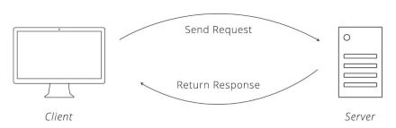
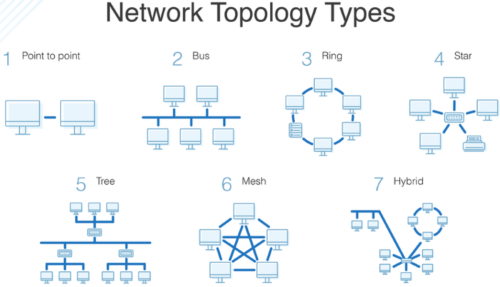
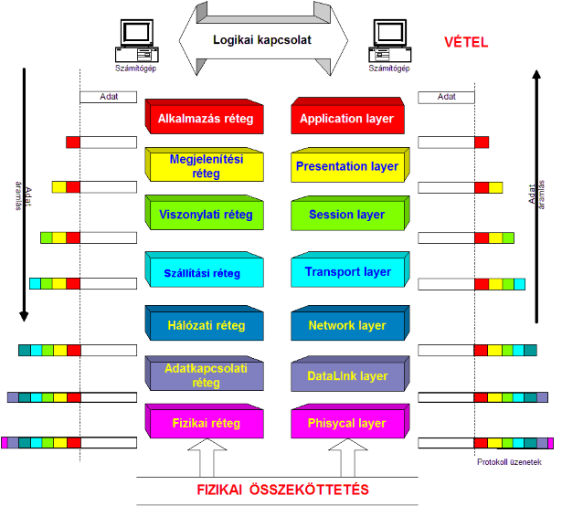
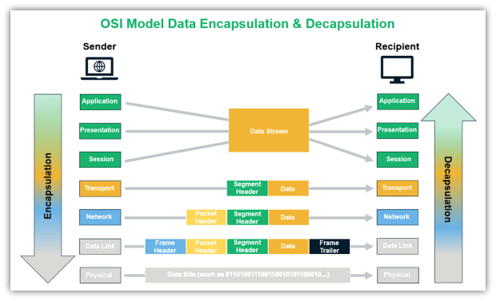
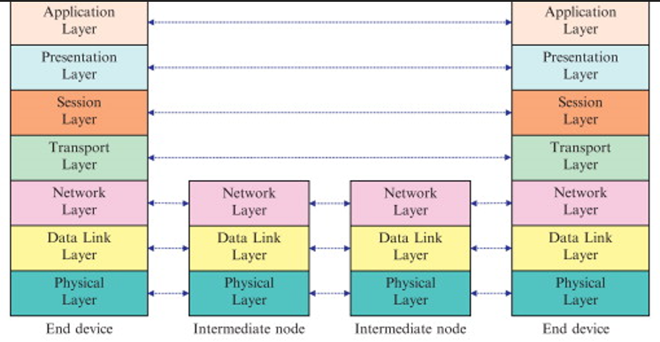
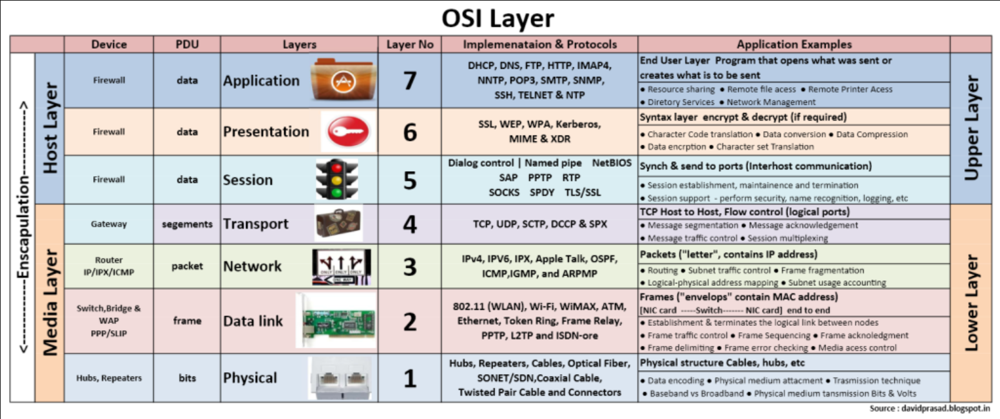
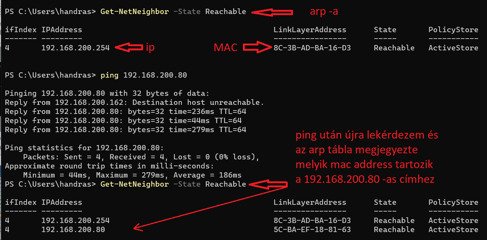

# Hálózati alapismeretek  

[Videók](#Videók)  
[Szoftverek, parancsok](#Szoftverek)  

Kezdetben voltak különálló számítógépek, hamar jött az ötlet, hogy ezeket össze is lehetne kötni.  
Ezért elkezdtek mindenféle számítógépes hálózatot kialakítani, azaz kapcsolatot létesíteni több szg között.  

cégek, Egyetemek, állami intézmények fejlesztettek saját hálózatot.

# Videók

## Mi az az IT-hálózat   
> A IT hálózatok alatt az egymással kapcsolatban lévő önálló számítógépek és eszközök rendszerét értjük.  
> Másik megfogalmazásban: a számítógép hálózat autonóm számítógépek összekapcsolt rendszere.  

A legkisebb számítógépes hálózat elemeinek száma 2.
## Miért alakultak ki, mi a céljuk, mire jók    
Elsődleges céljuk az információáramlás biztosítása, azaz hogy a számítógépek képesek legyen kommunikálni egymással.  

### Mi mindenre jó?    
- Erőforrás megosztás 
- Hozzáférés távoli információhoz  
- Nagyobb megbízhatósgág  
- Takarékosság  

### A hálózat tagjai   
- Kliensek (szg,laptop)  
- Kiszolgálók (szerverek)  
- Mobil eszközök (tabletek, telefonok)  
- Hálózati eszközök (switch, hub, router, tűzfal, jelismétlő, stb.)  
- Otthoni, szórakoztató eszközök TV, SetTopBox, NAS, Printer, Megfigyelő, beléptető rendszerek  
- IoT (Háztartási eszközök, játékok, Ingatlan vezérlés, led technológia, okosotthonok)  
- Ipari-, orvosieszközök, robotok  
- Hálózati átviteli közeg!    

Végtelen számú eszköz ami szeretne egymással kommunikálni, adatot cserélni, használni a megosztott erőforrásokat.   

**Ahhoz hogy megértsük a hálózatok működését nézzük miket kellett meghatározni, hogy a trilliónyi eszköz megértse egymást.**       
- **meg kell találják egymást a hálózaton**  
- **a hálózati eszközöknek tudniuk kell, hogy ki kicsoda a hálózatban, milyen címen találja meg**  
- **"azonos nyelvet kell beszélniük", azaz meg kell érteniük egymást**  
- **ugyanolyan fizikai tulajdonságokkal kell a jeleket küldeni**  
- **ugyanúgy kell dekódolniuk az adatokat**  
- **méretezhetőség**  

### Mindehez protokollokat vezzettek be. 
hatékony, megbízható, skálázható   
- egyezmény, szabvány  
- Két eszköz között a kommunikációt általában nem egy, hanem több protokoll valósítja meg.  
- kommunikáció formája, szabályai  

## Hálózat elmélet I   
Hogyan tudunk összekötni számítógépeket, hogy fognak kommunikálni egymással, milyen viszonban állnak?  
* Peer-to-peer, kliens-szerver model     
* Méret (LAN / MAN / WAN)  
* Topológiák  
* Protokollok (Ethernet, TCP/IP) 
    

---  

### Építőkövek, "lego kockák" amiből fel tudjuk építeni a hálózatokat.  

## Az OSI modell  
Egy **elvi** modell, amely az IT hálózatok funkcióit jellemzi és szabványosítja, függetlenül a technológiától és eszközöktől
Célja a különféle kommunikációs rendszerek szabványos kommunikációs protokollokkal való átjárhatósága.

[OSI modell wikipédia oldala](https://hu.wikipedia.org/wiki/OSI-modell)  
* 7 réteg, nem minden eszköz valósítja meg az összes réteget.
* Az ábrákon az 1.réteg mindig alúl szerepel
* Minden réteg használja az alatta lévő réteg szolgáltatásait.

### Mi történik amikor 2 végpont között kommunikáció zajlik? 
A kliens összeállítja (encapsulation) azt az adatcsomagot (keretet, frame), amit a hálózaton szeretne elküldeni a másik végponthoz ahonnan a választ várja.
A címzet felbontja (decapsulation) a kapott adatcsomagot , megalkotja a választ, összeállítja a válaszcsomagot és elküldi a másik végponthoz.  

Mivel a hálózaton több csomóponton (node) keresztül jut el a csomagunk a klienstől a kiszolgálóig és vissza, az eszközök a protkollok és beállításai alapján küldi tovább a csomagot a megfelelő irányba.
A csomagunk pattog a hálózati eszközök között amíg a kiszolgálóig nem ér.

  
  
---   
  
## Hálózati eszközök   

* Átviteli közegek (L1 - HUB)
* Switch, Access Point (L2)
* Router (L3)
  
---   

# Címzések
  
## Ethernet protokoll 
* OSI modell alsó 2 rétegét írja le  
* MAC address 
    - Egyedi (fizikai) azonosító, minden hálózati kapcsolatnak van.   
    - 48 bit, hexadecimális formában tároljuk pl: `9c-93-4e-d8-a3-eb`  
    - első 3 tag a gyártó azonosítója, második 3 tag az interface száma  
* arp táblák   
    - egyszerű szótár, tárolja a mac addresseket és a hozáájuk tartozó címet  
    - Switchek esetén az eszköz portjának azonosítóját is a megfelelő mac addresshez.  
    - automatikusan működik (lásd kép), tartalma változtatható, ha szükséges (ritka)  
* Terminál parancs: *arp* pl: W:`arp -a` L:`arp a`
  
  

  
# Internet protokoll  (IP)
* OSI modell 3. rétege
* Logikai címzés, útvonal (Route) meghatározás
* IP címek  
* Gateway
* IP verziók: IPv4, IPv6  
* Privát és publikus IP tartományok  
* Subnetek  
* Portok    
  
## TCP 
* OSI modell leképezése 4 rétegben
* IP címek
* Privát és publikus IP tartományok
* Subnetek
* Szállítási (Transport) réteg
* TCP/UDP/ICMP protokollok
* TCP 3-way handshake

8. **IT/IP matek**  
    * 2-es számrendszer
    * IP cím
    * subnet mask (ip calculator)  
    * latency, speed  

9. **Hálózati kiszolgálók**  
    * DNS
    * DHCP

---  

# Szoftverek

[Khan Academy](https://www.youtube.com/watch?v=Dxcc6ycZ73M&list=PLzdnOPI1iJNfMRZm5DDxco3UdsFegvuB7)
